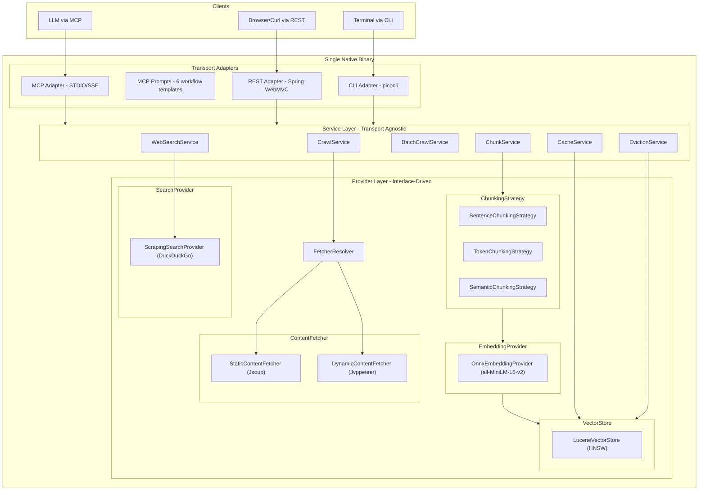

# Web Search API -- Architecture Document

## 1. System Overview

The Web Search API is a Java-native MCP (Model Context Protocol) service that provides LLMs with web search, page crawling, content chunking, and semantic vector caching capabilities -- all in a single binary.

**Key differentiators:**
- Self-contained: no external services required (local search scraping, local embeddings, local vector store)
- Provider-extensible: swap any component (search, fetch, embed, store) via configuration
- Three transport adapters: MCP (for LLMs), REST (for dev/test/UIs), CLI (for scripting)
- MCP Prompts: server-side workflow templates that teach LLMs to chain tools for complex operations
- Built-in semantic caching and TTL eviction for stale content

**Target users:** LLM applications, AI agents, developer tools, research pipelines.

## 2. Architecture Diagram



## 3. Technology Stack

| Component | Technology | Version |
|---|---|---|
| Runtime | Java | 25 |
| Native compilation | GraalVM | 25 |
| Framework | Spring Boot | 4.0.2 |
| MCP Server | spring-ai-starter-mcp-server | 1.0.0-M6 |
| Build | Gradle (Kotlin DSL) | 9.3.1 |
| Static fetching | Jsoup | 1.22.1 |
| Dynamic fetching | Jvppeteer | 2.1.0 |
| Vector search | Apache Lucene | 10.2.1 |
| Embeddings | ONNX Runtime | 1.23.2 |
| CLI | picocli | 4.7.7 |

## 4. Provider Interface Reference

All providers follow the same pattern: **interface + capabilities record + enriched request/response models + abstract base class(es)**.

### Two-Tier Base Class Pattern

- **`Abstract*Api*Provider`** -- For direct API services with simple API-key auth (OpenAI, Cohere, Firecrawl, Brave). Uses Java `HttpClient` + `Authorization` header.
- **`Abstract*Cloud*Provider`** -- For enterprise cloud platforms with SDK-managed auth (AWS Bedrock, Azure OpenAI, Google Vertex). Delegates to native cloud SDKs.

### 4.1 ContentFetcher

**Interface:** `com.noetic.websearch.provider.ContentFetcher`

| Method | Description |
|---|---|
| `type()` | Provider identifier ("static", "dynamic", etc.) |
| `capabilities()` | Returns `FetcherCapabilities` |
| `supports(FetchRequest)` | Whether this fetcher can handle the request |
| `fetch(FetchRequest)` | Fetch and return `FetchResult` |

**Request model:** `FetchRequest` -- url, renderJavaScript, timeout, waitForNetworkIdle, waitForSelector, includeLinks, includeImages, outputFormat, extra

**Response model:** `FetchResult` -- url, title, content, rawHtml, links, images, wordCount, statusCode, fetcherUsed, fetchTime, providerMeta

**Capabilities:** `FetcherCapabilities` -- supportsJavaScript, supportsWaitForSelector, supportsMarkdownOutput, supportsBotBypass, supportsProxy, supportsScreenshot, requiresApiKey, requiresLocalBinary

**Implementations:**
- `StaticContentFetcher` (Jsoup) -- ships now
- `DynamicContentFetcher` (Jvppeteer/CDP) -- ships now
- `AbstractApiContentFetcher` -- base for API fetchers (Firecrawl, Browserless, etc.)

### 4.2 SearchProvider

**Interface:** `com.noetic.websearch.provider.SearchProvider`

| Method | Description |
|---|---|
| `type()` | Provider identifier ("scraping", "brave", etc.) |
| `capabilities()` | Returns `SearchCapabilities` |
| `search(SearchRequest)` | Execute search, return `SearchResponse` |

**Request model:** `SearchRequest` -- query, maxResults, freshness, language, country, includeDomains, excludeDomains, safeSearch, searchDepth, extra

**Response model:** `SearchResponse` -- provider, results (List of SearchResult), aiAnswer, responseTime, fromCache

**SearchResult:** title, url, snippet, extraSnippets, rawContent, score, publishedDate, providerMeta

**Implementations:**
- `ScrapingSearchProvider` (DuckDuckGo HTML) -- ships now
- `AbstractApiSearchProvider` -- base for API providers (Brave, SerpAPI, Tavily)

### 4.3 EmbeddingProvider

**Interface:** `com.noetic.websearch.provider.EmbeddingProvider`

| Method | Description |
|---|---|
| `type()` | Provider identifier ("onnx", "openai", etc.) |
| `capabilities()` | Returns `EmbeddingCapabilities` |
| `embed(EmbeddingRequest)` | Single text embedding |
| `embedBatch(EmbeddingBatchRequest)` | Batch embedding |
| `dimensions()` | Output vector dimensions |
| `model()` | Active model name |

**Key concept -- `InputType`:** Services pass `DOCUMENT` when storing content and `QUERY` when searching. Critical for retrieval quality with Cohere, Voyage, and Vertex.

**Implementations:**
- `OnnxEmbeddingProvider` (all-MiniLM-L6-v2, 384-dim) -- ships now
- `AbstractApiEmbeddingProvider` -- base for API-key providers
- `AbstractCloudEmbeddingProvider` -- base for enterprise cloud SDK providers

### 4.4 VectorStore

**Interface:** `com.noetic.websearch.provider.VectorStore` (extends `AutoCloseable`)

| Method | Description |
|---|---|
| `initialize()` / `close()` | Lifecycle management |
| `upsert(VectorEntry)` | Insert or overwrite |
| `get(String id)` | Retrieve by ID |
| `delete(String id)` | Delete by ID |
| `upsertBatch(List)` / `deleteBatch(List)` | Batch operations |
| `search(VectorSearchRequest)` | Nearest-neighbor search |
| `count()` | Total entries |
| `deleteByMetadata(MetadataFilter)` | Bulk delete by filter |

**VectorEntry:** id, vector, content, entryType, createdAt, metadata

**Implementations:**
- `LuceneVectorStore` (HNSW) -- ships now
- `AbstractRemoteVectorStore` -- base for cloud providers (Pinecone, Qdrant, etc.)

### 4.5 ChunkingStrategy

**Interface:** `com.noetic.websearch.provider.ChunkingStrategy`

**Implementations:** `SentenceChunkingStrategy`, `TokenChunkingStrategy`, `SemanticChunkingStrategy`

## 5. Adapter Layer

### MCP Adapter (default)
- 6 tools with rich descriptions, parameter docs, behavioral annotations
- 6 MCP Prompts (workflow templates)
- Transport: STDIO (default) or SSE

### REST Adapter
- Spring WebMVC `@RestController` endpoints under `/api/v1/`
- Endpoints: search, crawl, sitemap, batch-crawl, chunk, cache
- Includes Spring Boot Actuator (health, metrics)

### CLI Adapter
- picocli subcommands: search, crawl, sitemap, batch-crawl, chunk, cache
- JSON output to stdout
- Activated via `--mode cli` or `ConditionalOnProperty`

### Mode Selection
```
./websearch                           --> MCP STDIO (default)
./websearch --mode rest               --> REST API on port 8080
./websearch --mode cli search "query" --> CLI one-shot
./websearch --mode mcp --transport sse --> MCP SSE
```

## 6. MCP Tool Catalog

| Tool | Description | Read-only | Idempotent |
|---|---|---|---|
| `web_search` | Search the internet for a query | Yes | Yes |
| `crawl_page` | Fetch and extract web page content | Yes | Yes |
| `discover_sitemap` | Find URLs from a domain via sitemap | Yes | Yes |
| `batch_crawl` | Crawl multiple URLs with sitemap discovery | No | No |
| `chunk_content` | Split content into chunks, embed, and cache | No | No |
| `cache_query` | Semantic search over cached content | Yes | Yes |

## 7. MCP Prompt Catalog

| Prompt | Purpose | Tools Chained |
|---|---|---|
| `extract_structured_data` | Extract JSON from a page per user schema | crawl_page -> LLM -> chunk_content |
| `deep_research` | Comprehensive topic research | web_search -> crawl_page (xN) -> chunk_content -> cache_query |
| `compare_sources` | Compare data across multiple URLs | crawl_page (xN) -> LLM extraction |
| `monitor_page` | Detect changes on a page | cache_query -> crawl_page -> LLM diff |
| `build_knowledge_base` | Exhaustively cache a topic | web_search -> crawl_page (xN) -> chunk_content (xN) |
| `ingest_website` | Ingest entire site via sitemap | discover_sitemap -> batch_crawl |

## 8. Data Model Reference

### Enums
- `OutputFormat` -- HTML, MARKDOWN, TEXT
- `Freshness` -- NONE, DAY, WEEK, MONTH, YEAR
- `SearchDepth` -- BASIC, ADVANCED
- `InputType` -- DOCUMENT, QUERY, CLASSIFICATION, CLUSTERING
- `AuthType` -- NONE, API_KEY, AWS_CREDENTIALS, AZURE_IDENTITY, GCP_ADC

### Key Records
All records are in `com.noetic.websearch.model`:

| Record | Key Fields |
|---|---|
| `FetchRequest` | url, renderJavaScript, timeout, outputFormat |
| `FetchResult` | url, title, content, links, images, fetcherUsed |
| `SearchRequest` | query, maxResults, freshness, language, includeDomains |
| `SearchResponse` | provider, results, aiAnswer, fromCache |
| `SearchResult` | title, url, snippet, score, publishedDate |
| `EmbeddingRequest` | text, inputType, outputDimensions |
| `EmbeddingResult` | vector, dimensions, tokenCount, model |
| `VectorEntry` | id, vector, content, entryType, createdAt, metadata |
| `VectorSearchRequest` | queryVector, topK, similarityThreshold, filter |
| `VectorMatch` | id, score, content, metadata |
| `MetadataFilter` | equals, contains, createdAfter, createdBefore |
| `ChunkRequest` | content, strategy, maxChunkSize, overlap |
| `ContentChunk` | chunkId, text, tokenCount, embeddingStored |

## 9. Configuration Reference

All configuration is in `src/main/resources/application.yml`. Key sections:

- `websearch.adapter` -- Mode selection (mcp/rest/cli), transport config
- `websearch.fetcher` -- Default fetcher, fallback chain, dynamic/API settings, domain rules
- `websearch.search` -- Active provider, per-provider API keys and settings
- `websearch.batch-crawl` -- Concurrency, rate limiting, max URLs, auto-chunk
- `websearch.chunking` -- Default strategy, max chunk size, overlap
- `websearch.embedding` -- Active provider, model paths, API keys (direct + enterprise)
- `websearch.store` -- Active store, namespace, similarity threshold, per-store settings
- `websearch.eviction` -- Enabled, schedule, max-entries, per-type TTL policies

All API keys read from environment variables with empty defaults: `${BRAVE_API_KEY:}`, `${OPENAI_API_KEY:}`, etc.

## 10. TTL Eviction System

**Level 1: Application-Level** (universal, always active)
- `EvictionService` runs on configurable cron (default: hourly)
- Per-entry-type TTL: search_result=24h, query_cache=6h, crawl_chunk=7d
- Max-entries cap (default: 100,000) evicts oldest when exceeded
- Uses `VectorStore.deleteByMetadata(MetadataFilter)` with time-range filters

**Level 2: Provider-Native** (when supported)
- For Milvus: passes TTL to collection properties
- `StoreCapabilities.supportsNativeTtl()` controls pass-through

## 11. Extension Guide

### Adding a New Search Provider (e.g., Brave)

1. Create `BraveSearchProvider` extending `AbstractApiSearchProvider` in `provider/search/`
2. Implement `type()` returning `"brave"`
3. Implement `capabilities()` with Brave's supported features
4. Implement `baseUrl()`, `apiKey()`, `buildRequest()`, `parseResponse()`
5. Annotate with `@Component` and `@ConditionalOnProperty(name = "websearch.search.active", havingValue = "brave")`
6. Add config under `websearch.search.brave` in `application.yml`
7. Set `websearch.search.active: brave` to activate

### Adding a New Vector Store (e.g., Pinecone)

1. Create `PineconeVectorStore` extending `AbstractRemoteVectorStore` in `provider/store/`
2. Implement all `VectorStore` interface methods
3. Implement `endpoint()`, `buildUpsertRequest()`, `buildSearchRequest()`, `parseSearchResponse()`
4. Add config under `websearch.store.pinecone` in `application.yml`
5. Set `websearch.store.active: pinecone` to activate

### Adding a New Enterprise Embedding Provider (e.g., Bedrock)

1. Create `BedrockEmbeddingProvider` extending `AbstractCloudEmbeddingProvider` in `provider/embedding/`
2. Implement `buildSdkClient()` to create `BedrockRuntimeClient`
3. Implement `invokeSdk()` and `invokeSdkBatch()` using the AWS SDK
4. Add `software.amazon.awssdk:bedrockruntime` to `build.gradle.kts`
5. Add config under `websearch.embedding.bedrock` in `application.yml`
6. Set `websearch.embedding.active: bedrock` to activate

## 12. Build and Deployment

### JVM Mode
```bash
./gradlew bootRun
```

### Native Image
```bash
./gradlew nativeCompile
./build/native/nativeCompile/websearch
```

### Docker (JVM)
```dockerfile
FROM eclipse-temurin:25-jre
COPY build/libs/web-search-api-*.jar app.jar
ENTRYPOINT ["java", "--enable-preview", "-jar", "app.jar"]
```

### Docker (Native)
```dockerfile
FROM ghcr.io/graalvm/native-image-community:25 AS build
COPY . /app
WORKDIR /app
RUN ./gradlew nativeCompile

FROM debian:bookworm-slim
COPY --from=build /app/build/native/nativeCompile/websearch /usr/local/bin/
ENTRYPOINT ["websearch"]
```

### Chromium Setup (for dynamic fetching)
The `DynamicContentFetcher` requires Chromium or Chrome installed:
- **macOS**: `brew install --cask chromium`
- **Linux**: `apt-get install chromium-browser`
- **Config**: Set `websearch.fetcher.dynamic.chromium-path` to the binary path, or `auto` for auto-detection
- **Disable**: Set `websearch.fetcher.dynamic.enabled: false` to skip
